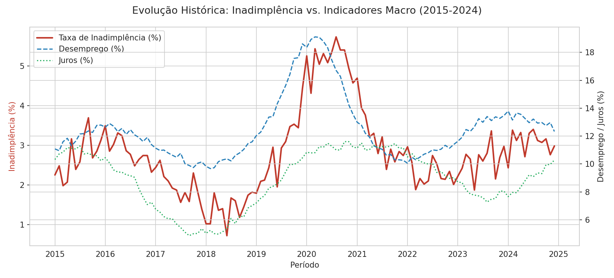
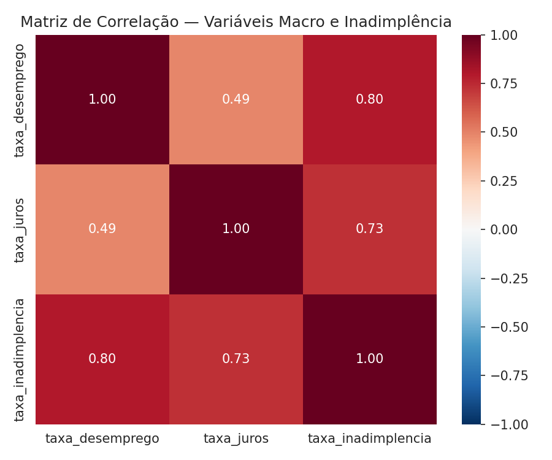
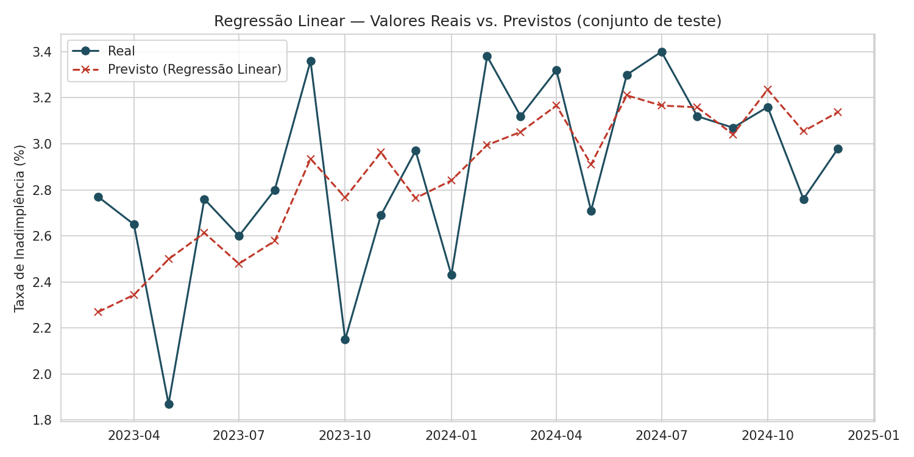
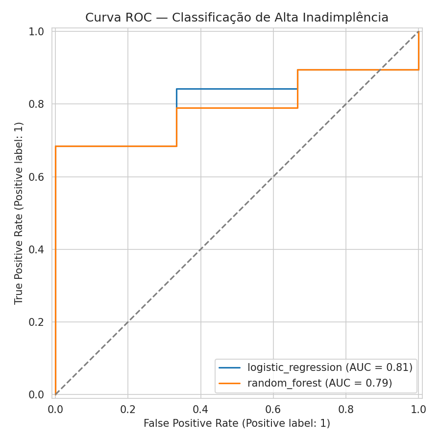
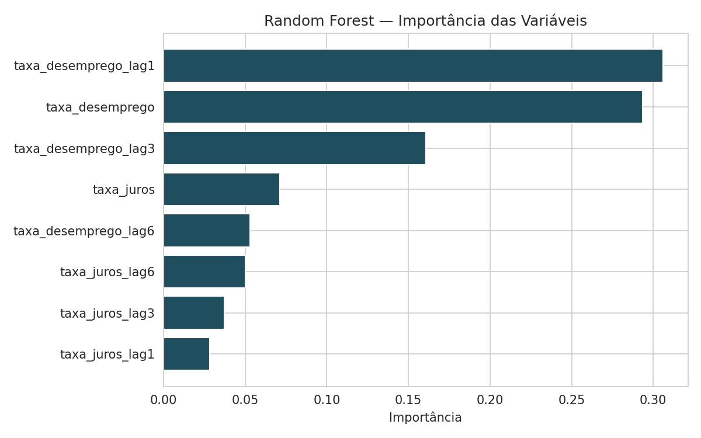

# 📊 Análise e Previsão de Inadimplência — Risco de Crédito (Fintech)

Projeto pessoal de Data Science aplicado a um cenário simulado de risco de crédito, usando indicadores macroeconômicos para antecipar deterioração de carteira.

> **Nota de transparência:** este é um projeto pessoal/portfólio, não uma entrega profissional. Os dados são **sintéticos**, gerados de forma reprodutível (ver `src/data_generator.py`), com relações econômicas plausíveis para simular um cenário real de fintech de crédito.

## 🎯 Visão Executiva

Este projeto simula o cenário de uma fintech de crédito que precisa antecipar movimentos de deterioração da carteira a partir de variáveis macroeconômicas (desemprego e juros), respondendo duas perguntas de negócio complementares:

1. **"Qual será a taxa de inadimplência no próximo período?"** → modelo de regressão (previsão contínua)
2. **"Este mês tende a ser pior que o mesmo mês do ano passado?"** → modelo de classificação (alerta binário)

Isso permite decisões como ajuste de política de concessão, revisão de limites de crédito, reprecificação de taxas e reforço de provisionamento (PDD).

## 🧠 Problema de Negócio

Instituições financeiras operam sob risco constante de inadimplência. Movimentos macroeconômicos — como aumento do desemprego ou da taxa de juros — impactam a qualidade da carteira, normalmente com **efeito defasado** (a inadimplência reage meses depois do choque macro, não instantaneamente).

**Pergunta central:** é possível antecipar movimentos de alta na inadimplência utilizando variáveis macroeconômicas defasadas?

## 📁 Estrutura do Projeto

```
credit-risk-analysis-fintech/
├── data/
│   ├── raw/                     # série sintética gerada
│   └── processed/               # dataset com features (lags + target)
├── src/
│   ├── data_generator.py        # geração reprodutível dos dados sintéticos
│   ├── data_loader.py           # carregamento e tratamento
│   ├── feature_engineering.py   # lags e criação dos targets
│   ├── modeling.py              # regressão + classificação
│   └── visualizer.py            # geração dos gráficos
├── models/                      # modelos treinados (.pkl)
├── outputs/
│   ├── graficos/                # PNGs gerados pelo pipeline
│   └── metricas/                # metricas.json com os resultados
├── main.py                      # orquestra o pipeline completo
├── requirements.txt
└── LICENSE
```

## 🔎 Abordagem Analítica

### 1️⃣ Geração e Tratamento de Dados
- Série mensal sintética de 2015 a 2024 (120 meses), com choque simulado em 2020
- Interpolação temporal para eventuais valores ausentes (nunca preenchimento por média global, que quebraria a estrutura temporal)

### 2️⃣ Engenharia de Atributos
- Lags de 1, 3 e 6 meses para desemprego e juros
- Dois targets, na mesma granularidade mensal (nunca misturando dado agregado com dado por cliente):
  - `taxa_inadimplencia` (contínuo) → regressão
  - `alta_inadimplencia` (binário, comparação **year-over-year**) → classificação

> **Por que YoY e não mediana móvel?** Uma primeira versão usava corte por mediana móvel de 12 meses. Como a série tem tendência de longo prazo, isso desbalanceava o período de teste e os classificadores "aprendiam" a tendência em vez de um padrão real (recall perfeito com ROC-AUC ~0,55 — sintoma de classificador degenerado). A comparação YoY neutraliza a tendência e resultou em um dataset balanceado (54 vs. 54 observações).

### 3️⃣ Análise Exploratória (EDA)
- Correlação forte entre desemprego e inadimplência (**r = 0,80**) e entre juros e inadimplência (**r = 0,73**)
- Efeito defasado visível: picos de desemprego antecedem picos de inadimplência




### 4️⃣ Modelagem — Split Cronológico (nunca aleatório)
Treino: jan/2016 a fev/2023 (86 meses) | Teste: mar/2023 a dez/2024 (22 meses)

**Regressão Linear** (prever a taxa contínua):

| Métrica | Valor |
|---|---|
| MAE | 0,254 p.p. |
| RMSE | 0,307 p.p. |
| R² | 0,385 |



**Interpretação de negócio dos coeficientes:** o coeficiente de `taxa_desemprego_lag3` (+1,36) é o mais relevante do modelo — um aumento no desemprego de 3 meses atrás é o sinal mais forte de alta na inadimplência hoje, confirmando o efeito defasado esperado. O R² de 0,385 indica que as variáveis macro explicam boa parte, mas não toda a variação da inadimplência — o que é esperado e realista: fatores idiossincráticos de carteira (não capturados aqui) também pesam.

**Classificação — "este mês tende a piorar frente ao mesmo mês do ano anterior?"**

| Modelo | Acurácia | Precisão | Recall | ROC-AUC |
|---|---|---|---|---|
| Regressão Logística | 0,818 | 0,857 | 0,947 | **0,807** |
| Random Forest | 0,864 | 0,864 | 1,000 | 0,790 |




**Achado interessante:** a Regressão Logística (modelo mais simples) teve ROC-AUC ligeiramente superior ao Random Forest. Isso é coerente com a literatura: em datasets pequenos (86 observações de treino), modelos com menos parâmetros tendem a generalizar melhor, enquanto o Random Forest é mais propenso a overfitting mesmo com regularização (`max_depth=3`, `min_samples_leaf=6`). Em produção, com mais anos de histórico, essa relação poderia se inverter.

### 5️⃣ Exportação
Modelos treinados salvos em `models/` (`.pkl`, via `Pipeline` do scikit-learn — inclui normalização, pronto para uso em produção).

## ⚠️ Limitações Conhecidas

- **Dados sintéticos:** as relações foram simuladas de forma plausível, mas não substituem validação com dados reais de carteira
- **Amostra pequena (108 meses úteis):** modelos mais complexos (Random Forest, redes neurais) tendem a ter ganho marginal limitado nesse volume de dados
- **Apenas 2 variáveis macro:** um modelo de produção incluiria inflação, câmbio, e variáveis específicas da carteira (perfil do cliente, histórico de pagamento)
- **R² moderado (0,385) na regressão:** o modelo captura a tendência mas não os picos de curto prazo — adequado para planejamento estratégico, não para decisão operacional individual de crédito

## 🛠 Stack Tecnológica

Python 3.10+ · Pandas · NumPy · Scikit-Learn (Pipeline, LinearRegression, LogisticRegression, RandomForestClassifier) · Matplotlib · Seaborn

## 🔹 Como Executar

```bash
git clone https://github.com/engvictortech/credit-risk-analysis-fintech.git
cd credit-risk-analysis-fintech
pip install -r requirements.txt

python src/data_generator.py      # gera o dataset sintético
python main.py                    # roda o pipeline completo (features, modelos, gráficos, métricas)
```

Resultados: métricas em `outputs/metricas/metricas.json`, gráficos em `outputs/graficos/`, modelos em `models/`.

## 🚀 Roadmap Técnico

- [ ] Incluir variáveis adicionais (inflação, câmbio) na simulação
- [ ] Testar validação walk-forward (múltiplas janelas de treino/teste) em vez de split único
- [ ] Adicionar dashboard executivo (Power BI) consumindo os outputs deste pipeline
- [ ] Testar Gradient Boosting (XGBoost/LightGBM) como terceiro modelo de comparação

## 👤 Autor

**Victor Hugo Miranda Crispim**
Bacharel em Análise de Dados — EBAC
Projeto pessoal aplicado a cenários de concessão e risco de crédito B2B/B2C
[LinkedIn](https://linkedin.com/in/victorhugocrispim)
